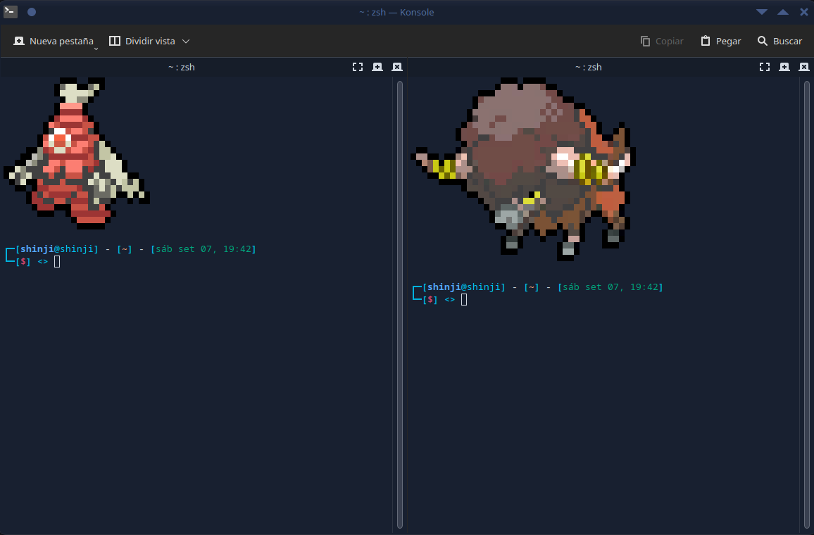
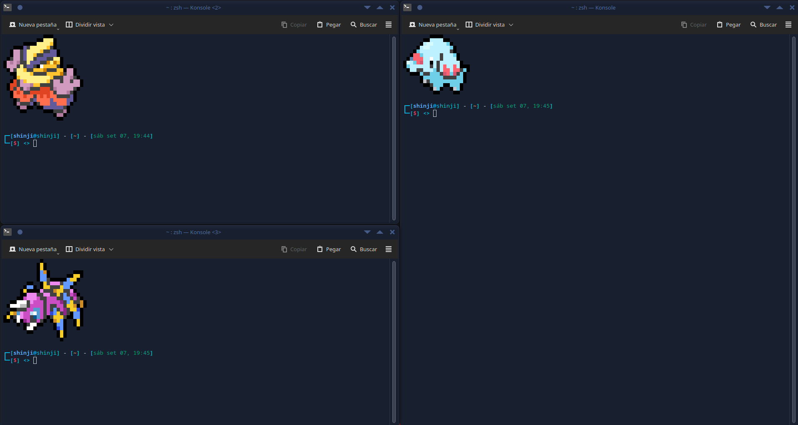
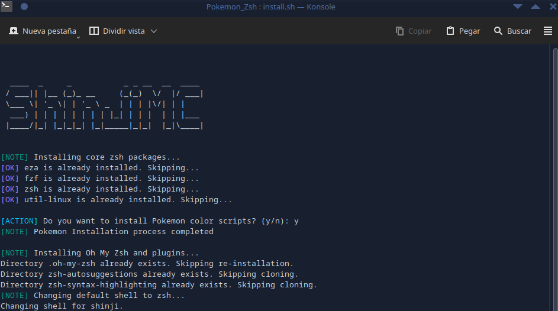
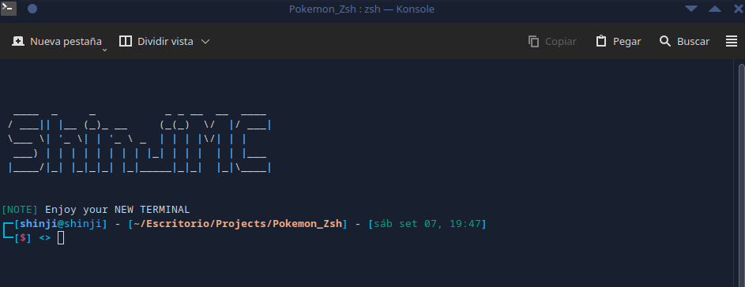

<div align="center">
  <h1>ZSH Setup COnfiguration Pro with Pokemon Color Scripts</h1>
</div>

<div align="center">

[](https://git.io/typing-svg)

</div>

<div align="center">
  
  
  
  
  
  
  
  


[]()


</div>

## Table of Contents

- [Description](#description)
- [Visuals](#visuals)
- [Screenshots](#screenshots)
- [Requirements](#requirements)
- [Installation](#installation)
- [Location of the files](#location-of-the-files)
- [How it works](#how-it-works)
- [Credits](#credits)
- [Author](#author)
- [License](#license)

## Description

The **ZSH Setup Configuration Pro with Pokemon Color Scripts** is a comprehensive setup script designed to configure your ZSH shell environment with essential tools, plugins, and a visually enhanced setup. This script also provides an optional installation of Pokemon color scripts to personalize your terminal experience.

## Visuals




## Screenshots




## Requirements

- `python3` - for pokemon color scripts
- `git` - for version control
- `wget` - for downloading installation scripts

## Installation

1. **Clone the repository:**

   ```bash
   git clone https://github.com/ShinjiMC/Zsh-Setup-Pro.git
   ```

2. **Navigate to the project directory:**

   ```bash
   cd Zsh-Setup-Pro
   ```

3. **Run the installation script:**

   ```bash
   chmod +x install.sh
   ./install.sh
   ```

4. Follow the prompts to install Pokemon color scripts if desired.

## Location of the Files

- **Installation Script:** `install.sh`
- **Configuration Files:** Located in the `assets/` directory within the repository.

## How it Works

The installation script performs the following actions:

1. Installs core ZSH packages.
2. Prompts the user to install Pokemon color scripts.
3. Configures Oh My Zsh and installs necessary plugins.
4. Updates ZSH configuration files and backups existing configurations.
5. Changes the default shell to ZSH if not already set.

## Credits

- **Oh My Zsh:** [https://github.com/ohmyzsh/ohmyzsh](https://github.com/ohmyzsh/ohmyzsh)
- **Zsh Autosuggestions:** [https://github.com/zsh-users/zsh-autosuggestions](https://github.com/zsh-users/zsh-autosuggestions)
- **Zsh Syntax Highlighting:** [https://github.com/zsh-users/zsh-syntax-highlighting](https://github.com/zsh-users/zsh-syntax-highlighting)
- **Pokemon Color Scripts:** [https://gitlab.com/phoneybadger/pokemon-colorscripts](https://gitlab.com/phoneybadger/pokemon-colorscripts)

## Author

- **ShinjiMC** - [GitHub Profile](https://github.com/ShinjiMC)

## License

This project is licensed under the MIT License. See the [LICENSE](LICENSE) file for details.
